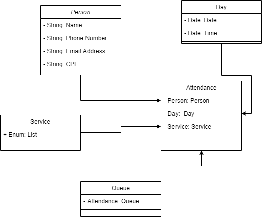

# Agendamento

Sistema Web utilizando linguagem Java onde será possível a criação e gerenciamento de filas de atendimento,
permitindo para o usuário uma forma mais prática de agendamento dos serviços disponibilizados e para os 
prestadores de serviço uma fila organizada e prática.

## Diagrama de Classes:

  - 

## Arquitetura:

  - Padrão MVC;
  - Banco de dados PostgreSQL;
  - Mapeamento Objeto-relacional;
  - Maven;
  - JPA e Hibernate para acesso ao banco de dados;
  - Padrão DAO;
  - Padrão Singleton.

## Colaboradores:
  
  - [@jjunio01](https://github.com/jjunio01) José Junio Araújo da Silva  
  - [@mikaelbr073](https://github.com/Mikaelbr073) Mikael Carvalho de Barros
